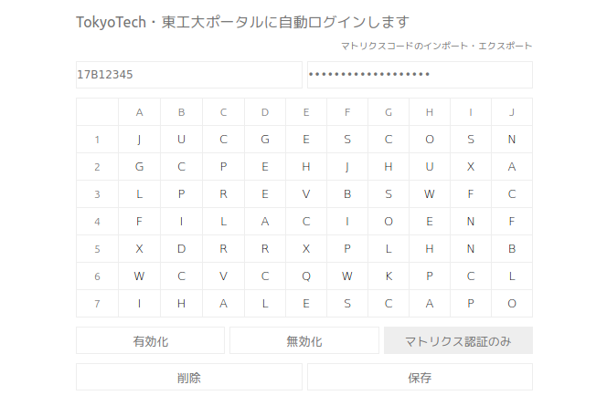

= TokyoTech・東工大ポータルに自動ログインするChrome拡張

== 機能

=== 東工大ポータルへの自動ログイン

東工大ポータルへのログインを自動化します．
ログイン動作は3パターン設定できます．

* パスワード認証・マトリクス認証を省略
* マトリクス認証のみ省略
* 何もしない

=== TokyoTechへの自動ログイン

キャンパス無線LANへのログインを自動化します．

=== マトリクスコードのインポート・エクスポート

他のコンピュータのChromeで設定するとき，マトリクスコードを何度も打ち直さずに済みます．
(自分宛のDMで送るとかね)

== インストール方法

具体的なインストール方法はブログ記事を参照してください． +
https://blog.mi2428.net/2016/04/08/%E6%9D%B1%E5%B7%A5%E5%A4%A7%E3%83%9D%E3%83%BC%E3%82%BF%E3%83%AB%E3%81%AB%E8%87%AA%E5%8B%95%E3%83%AD%E3%82%B0%E3%82%A4%E3%83%B3%E3%81%99%E3%82%8Bchrome%E6%8B%A1%E5%BC%B5%E3%82%92%E4%BD%9C%E3%81%A3%E3%81%9F/[東工大ポータルに自動ログインするChrome拡張を作った | Mi's blog] 

== 動作保証

次の環境で動作を確認しました(17年3月現在)．

* 教育用電子計算機システム・演習室
* 情報工学科電子計算機室
